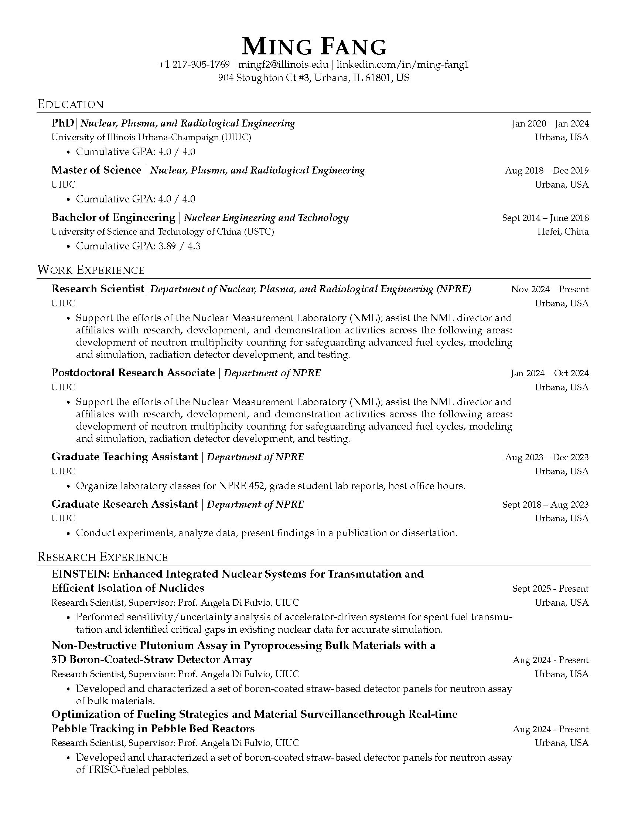
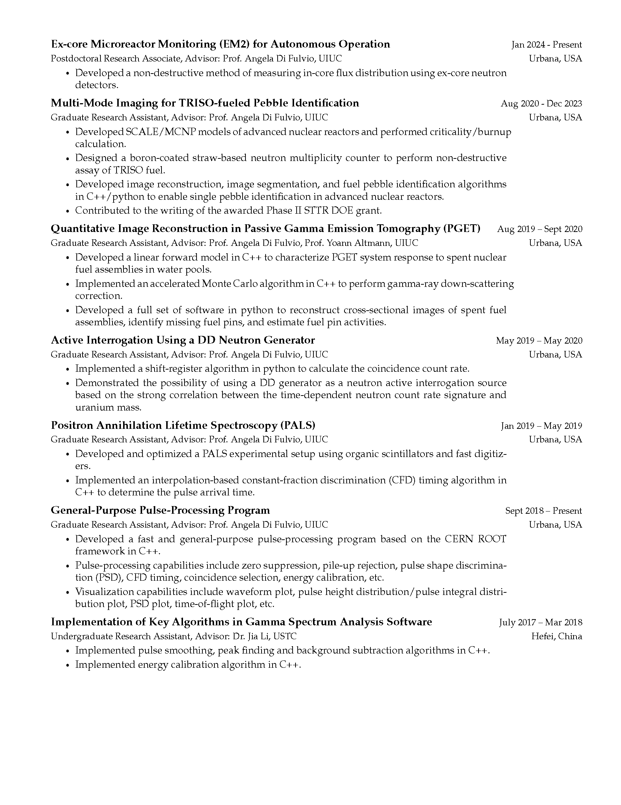
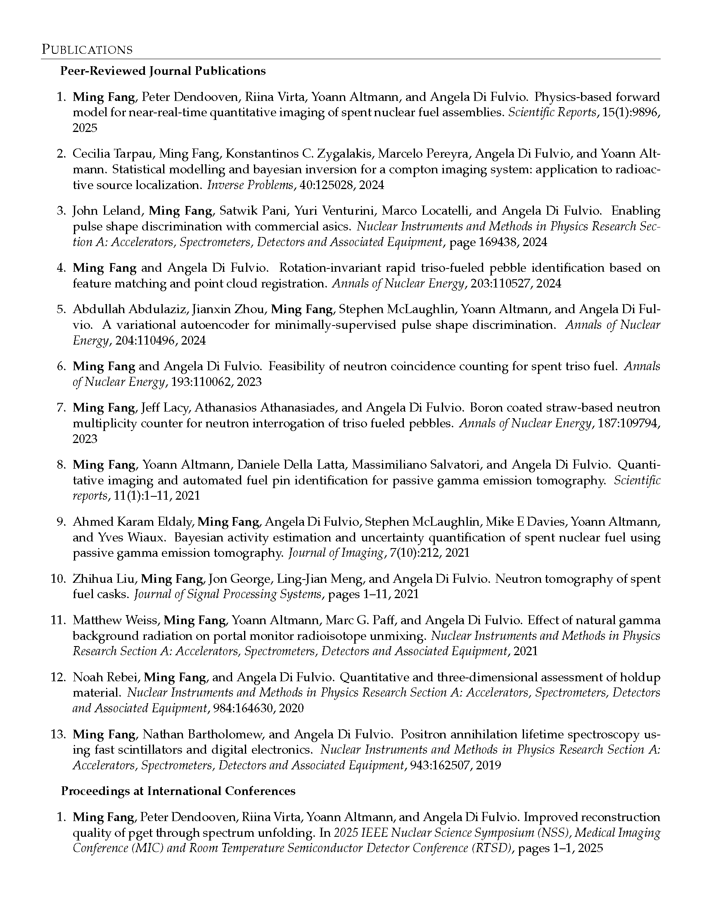
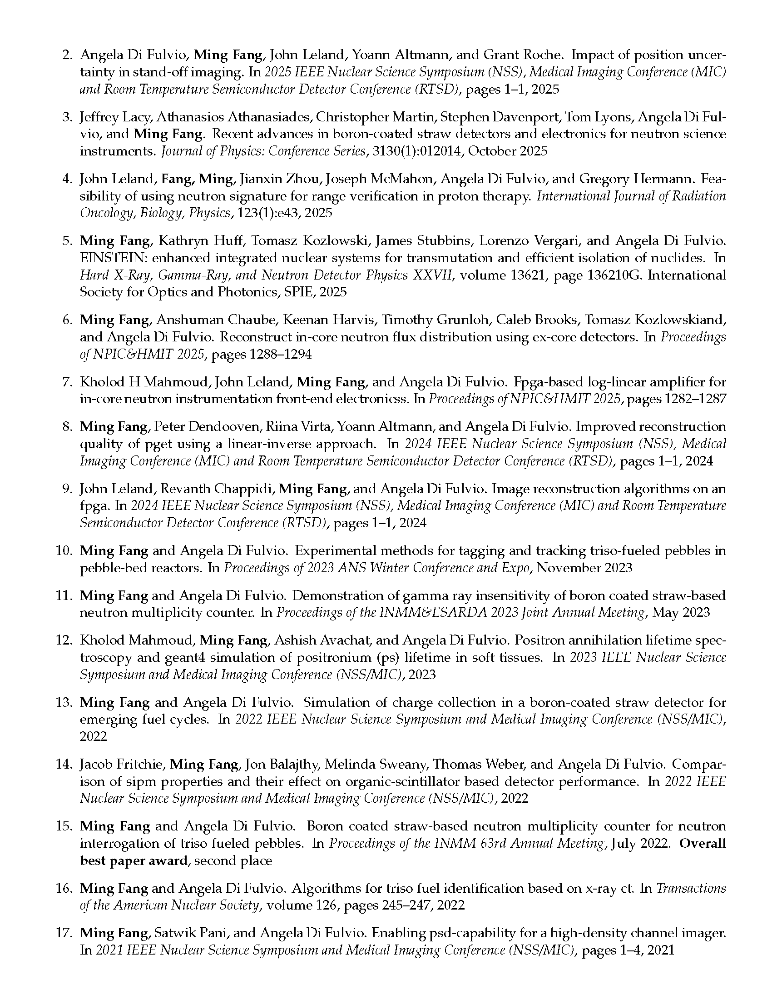
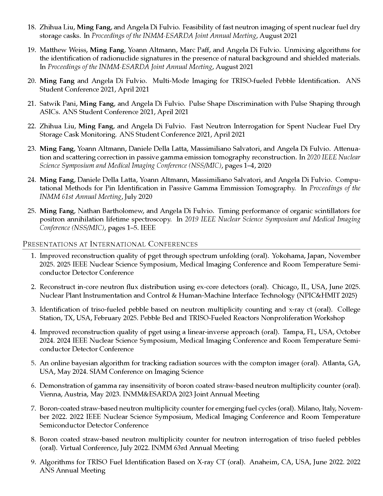
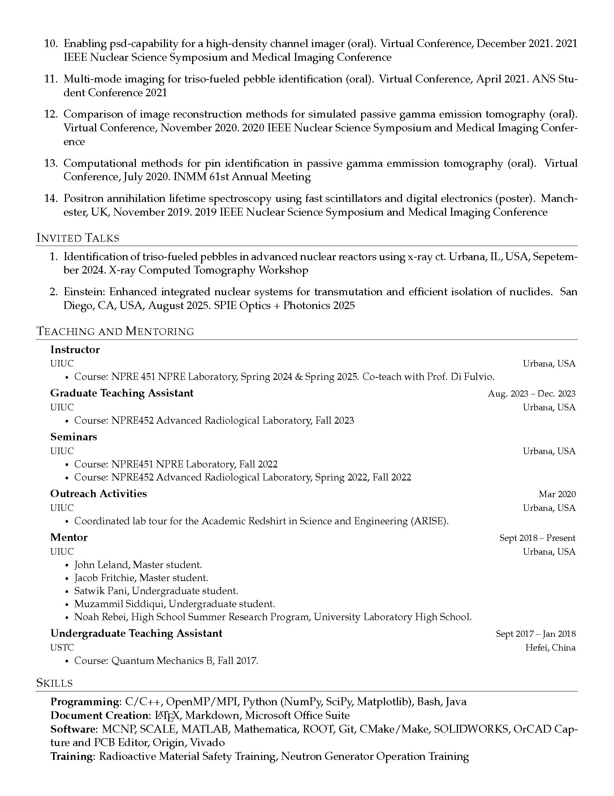
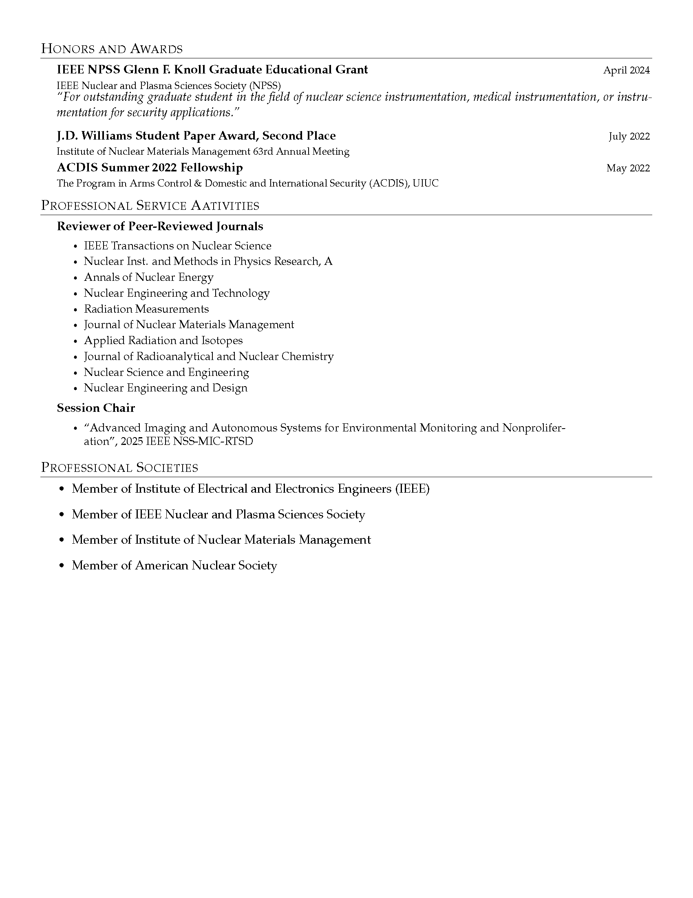

<!--
 * @Description: 
 * @Author: Ming Fang
 * @Date: 2023-01-01 16:17:58
 * @LastEditors: Ming Fang
 * @LastEditTime: 2026-01-18 22:56:10
-->
# Ming-CV

Repository for my CV on Overleaf. To use the same template for your CV, download a copy, upload it to Overleaf, and edit the CV.tex. 

